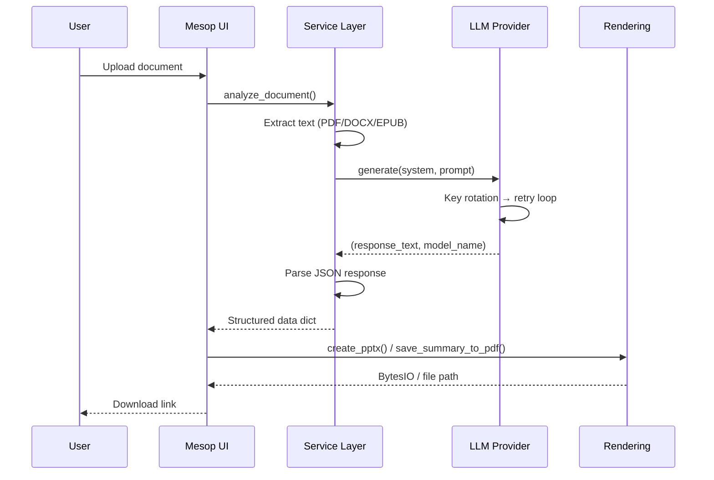

# Architecture Overview

SlideGenius v2.0 follows a **layered architecture** with clean separation of concerns.

## Module Structure

```
app/
├── config.py            # Pydantic BaseSettings — single source of truth
├── core/                # Cross-cutting utilities
│   ├── cancellation.py  # Thread-safe cancel signalling
│   ├── json_parser.py   # Robust LLM JSON parser
│   └── log.py           # Structured logging, observability
├── prompts/             # LLM prompt templates (static strings)
│   ├── slide.py
│   ├── summary.py
│   └── review.py
├── providers/           # Strategy Pattern — LLM provider abstraction
│   ├── base.py          # ABC with retry/fallback loop
│   ├── registry.py      # Factory + discovery
│   ├── gemini.py        # Google Gemini (native PDF)
│   ├── openai_provider.py  # OpenAI GPT-4o, o-series
│   ├── ollama.py        # Local LLM (DGX Spark)
│   ├── anthropic_provider.py  # Anthropic Claude
│   └── litellm_provider.py   # Universal adapter (100+ providers)
├── services/            # Business logic orchestration
│   ├── document.py      # PDF/DOCX/EPUB text extraction
│   ├── slide.py         # Document → structured slide data
│   ├── summary.py       # Standard + Deep Dive summarisation
│   └── review.py        # 3-step syntopic book review
├── rendering/           # Output generation
│   ├── pdf.py           # ReportLab PDF with fonts, styles
│   └── pptx.py          # python-pptx PowerPoint generation
└── ui/                  # Mesop web interface
    ├── state.py          # Reactive state definition
    ├── handlers.py       # Event handlers + async flows
    └── page.py           # Layout components
```

## Data Flow



## Design Patterns

### Strategy Pattern (Providers)

All LLM providers inherit from `LLMProvider` ABC and implement `_call_model()`. The shared `generate()` method handles:

- API key rotation (with dedup)
- Cyclic model fallback with configurable retry cycles
- Smart delay between retries
- Cancel check integration
- Error classification (permanent vs temporary vs abort)

### Registry Pattern

`app.providers.registry` maintains a dict of provider classes. New providers are registered automatically on import, or manually via `register_provider()`.

### Pydantic Settings

`AppConfig` validates all environment variables at startup with type checking, defaults, and custom validators. Accessed via `settings` singleton.
