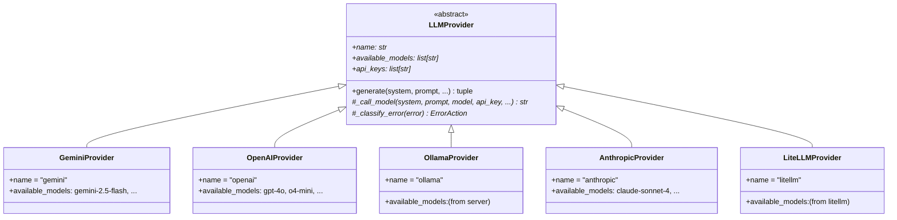

# LLM Provider Architecture

The provider layer abstracts away differences between LLM APIs behind a unified interface.

## Class Hierarchy



## Key Concepts

### API Key Rotation

Providers can accept multiple API keys (comma-separated in env vars). The base class deduplicates keys and cycles through them on failure, preventing the same key from being retried immediately.

### Model Fallback

When a model call fails, the system falls back to the next model in `available_models`. After exhausting all models, it starts a new retry cycle (up to `max_retry_cycles`).

### Error Classification

Each provider implements `_classify_error()` which returns one of:

| ErrorAction | Meaning | Behaviour |
|---|---|---|
| `RETRY` | Temporary failure (rate limit, timeout) | Retry with next key/model |
| `PERMANENT` | Invalid request, auth failure | Skip this key, try next |
| `ABORT` | Fatal error (cancelled) | Stop immediately |

### Adding a New Provider

1. Create `app/providers/your_provider.py`
2. Subclass `LLMProvider` and implement:
   - `name`, `available_models`, `api_keys` properties
   - `_call_model()` method
   - `_classify_error()` method
3. Register in `app/providers/registry.py`:

```python
try:
    from app.providers.your_provider import YourProvider
    register_provider("your_name", YourProvider)
except ImportError:
    pass
```

4. Update `app/config.py`:
   - Add API key field
   - Add to `_validate_provider` allowed set
   - Add to `detect_provider()` priority chain
