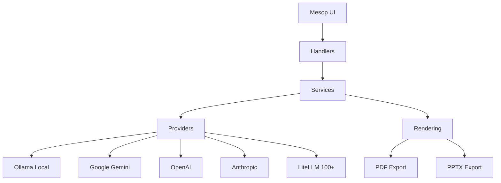

# SlideGenius Documentation

**AI-powered presentation & document analysis toolkit** — generate slides, summaries, and expert reviews from any document.

## Features

- **Multi-Provider LLM Support** — Ollama (local/free), Google Gemini, OpenAI, Anthropic Claude, LiteLLM (100+ providers)
- **Document Ingestion** — PDF, DOCX, EPUB extraction
- **Slide Generation** — Structured PowerPoint (PPTX) from document analysis
- **Document Summarisation** — Standard and Deep Dive modes with PDF export
- **Syntopic Book Review** — 3-agent pipeline (Librarian → Analyst → Editor)
- **Web UI** — Mesop-based interactive interface with real-time progress

## Quick Links

| Section | Description |
|---------|-------------|
| [Installation](getting-started/installation.md) | Set up your development environment |
| [Configuration](getting-started/configuration.md) | Environment variables and settings |
| [Architecture](architecture/overview.md) | System design and module structure |
| [API Reference](api/config.md) | Auto-generated module documentation |
| [Testing](development/testing.md) | Running and writing tests |

## Architecture at a Glance

